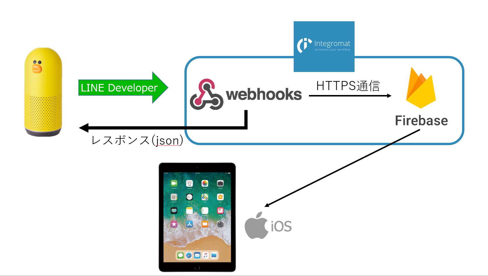

interactibook

## 製品概要
### 子育て x Tech

### 背景（製品開発のきっかけ、課題等）
今年の上半期の児童虐待通告は3万7000人と過去最多であり、その中でも、心理的虐待は２万６４１５人と大多数を占めています。心理的虐待の起こる理由は「育児ストレスなどにより子供へ愛情を持てなくなること」が原因です。
愛情を育むツールとして絵本は有名ですが、はたして「親」は楽しめているのでしょうか？「愛情不足」の原因は、そこあると私たちは考えました。
そこで、「子」も「親」も楽しめるコミュニケーションツールとして、「インタラクティブな絵本」を提案します。
イソップ童話、グリム童話などをタブレット上で楽しむことができます。また、IoTデバイスを利用し、声を発したりスイッチを押したりして、タブレットの中のキャラクターをインタラクティブに動かすことがでます。例えば、「北風と太陽」といった童話であれば、「ビュービュー」といった擬音語を発すると、タブレット上の「くも」から「風が吹く」といったイメージです。

### 製品説明（具体的な製品の説明）こちらに製品の概要・特徴について説明を記載してください。
iOSアプリを起動した状態でClovaに話しかけることで、本製品の利用を開始します。
最初に絵本を選ぶ画面で、読みたい絵本を選びます（できたらトップの画像）
絵本が始まったら、「Clova、〇〇(絵本タイトル)を開いて」と話しかけます。その後は、絵本の内容に沿って場面が描画されます。
場面ごとに、
* 画面のキャラクターや背景の対象物をタップする
* ある特定のものに関するワード(風、北風、びゅーびゅー、など)をClovaに言う
上記の操作をすることで、iOSで描画されているキャラクターや対象物に変化が起きます。
その変化は絵本のシナリオに沿ったものもあれば、そうでないものもあります。色々試してみることで普通の紙の絵本よりも
インタラクティブに楽しむことができます。

### アプリ連携フロー図

### 特長

#### 1. 特長1
既存の本と違い、目に見える形でキャラクターや対象物が動きます。
#### 2. 特長2
親子で一緒に本製品を使用することで会話が増えるため、親が感じる育児ストレスを軽減できます。

#### 3. 特長3
Clovaを使用することで、発話した言葉からキャラクターが新しい動きをするため、
「どんな言葉を発すれば、このキャラクターはどんな動きをするかな？」
などの楽しみが増え、親や子の想像力が膨らみやすくなります。

### 解決出来ること
現代の親と子のコミュニケーション不足

### 今後の展望
* 今後さまざまな絵本に対応させるため、多様な対象年齢に対する絵本の追加
* さまざまな年齢の子供が利用できるように考えているため、年齢によってはClovaが聞き取れない場合もある。
それをできる限りなくすため、さまざまな発言に対応できるようにする。

## 開発内容・開発技術
### 活用した技術
* Integromat
* Webhook
* firebase
* LINE developer
* Swift

#### API・データ
今回スポンサーから提供されたAPI、製品などの外部技術があれば記述をして下さい。

なし

#### フレームワーク・ライブラリ・モジュール
* iOS -> firebase の連携
* sprite Kit (iOSの物理演算モジュール)

#### デバイス
* iPad(iPad mini)
* Clova

### 研究内容・事前開発プロダクト（任意）
ご自身やチームの研究内容や、事前に持ち込みをしたプロダクトがある場合は、こちらに実績なども含め記載をして下さい。

* 3DプリンターとレーザーカッターでClova(サリーの家を作成)

### 独自開発技術（Hack Dayで開発したもの）
#### 2日間に開発した独自の機能・技術
* 独自で開発したものの内容をこちらに記載してください
* 特に力を入れた部分をファイルリンク、またはcommit_idを記載してください（任意）
